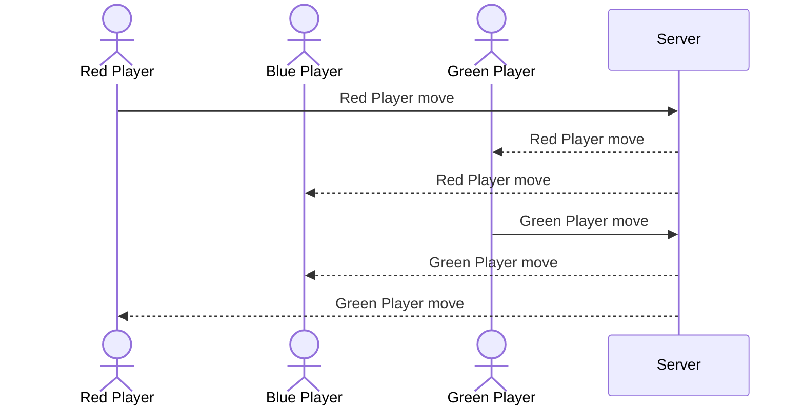

# Candy Land

[My Notes](notes.md)

Candy Land basic gameplay online. Move your pieces to get to the castle of King Kandy and win! Watch out for licorice and things that might slow you down.

## 🚀 Specification Deliverable

For this deliverable I did the following. I checked the box `[x]` and added a description for things I completed.

- [x] Proper use of Markdown
- [x] A concise and compelling elevator pitch
- [x] Description of key features
- [x] Description of how you will use each technology
- [x] One or more rough sketches of your application. Images must be embedded in this file using Markdown image references.

### Elevator pitch

Have you ever had a sweet tooth you can't satisfy? Are you feeling nostalgic about your childhood? This is the place for you! Play Candy Land online, anytime, anywhere! Race against your opponent gingerbread pieces to the castle of King Kandy and get the satisfaction of winning!

### Design

The login page will navigate to the game play page where players can draw their card and move their character

### Key features

- Each player will draw cards
- Each player can move to the colored squares on the board
- Login over https
- Registering into the database too
- Each player position will be saved in the database
- Everyone will be notified when someone wins the game

### Technologies

I am going to use the required technologies in the following ways.

- **HTML** - Creation of basic pages for rules, login, and gameplay
- **CSS** - color palletes that match the game and have great contrast, changing smoothly for different screen sizes
- **React** - help with login, display position of players, changing the card played
- **Service** - backend service with endpoints for
      - login
      - update player
      - update card
      - notify players
- **DB/Login** - storing of login data, active players, positions, can't play if not logged in
- **WebSocket** - when cards are played or players are moved it is updated for everyone

## 🚀 AWS deliverable

For this deliverable I did the following. I checked the box `[x]` and added a description for things I completed.

- [x] **Server deployed and accessible with custom domain name** - [My server link](https://heapgames.click).

## 🚀 HTML deliverable

For this deliverable I did the following. I checked the box `[x]` and added a description for things I completed.

- [x] **HTML pages** - I added 4 html pages: The home page index.html, play.html, progress.html, and about.html
- [x] **Proper HTML element usage** - I properly added headers, footers, main, divs, etc. 
- [x] **Links** - I added a link to my git hub repo in the footer and 4 other pages in the header
- [x] **Text** - Text explaining the different components of the game is added
- [x] **3rd party API placeholder** - There is a placeholder to replace later
- [x] **Images** - Game Board, logos, and images present
- [x] **Login placeholder** - Input fields and buttons await functionality
- [x] **DB data placeholder** - Fake content is added to represent where the database info will be
- [x] **WebSocket placeholder** - Progress bars will update to show how far people are and the game board will show other players in the game

## 🚀 CSS deliverable

For this deliverable I did the following. I checked the box `[x]` and added a description for things I completed.

- [x] **Visually appealing colors and layout. No overflowing elements.** - Each Element stays in it's area and has visually appealing colors that match candy land
- [ ] **Use of a CSS framework** - I did not use bootstrap, I wanted to get this in on time
- [x] **All visual elements styled using CSS** - Everything was styled using css to look prettier. This includes boxes and image placement
- [x] **Responsive to window resizing using flexbox and/or grid display** - When you go to mobile everything moves to not be squished
- [x] **Use of a imported font** - I used the Milonga font from google
- [x] **Use of different types of selectors including element, class, ID, and pseudo selectors** - I selected classes, ids, elements, and even the whole page to set fonts and colors

## 🚀 React part 1: Routing deliverable

For this deliverable I did the following. I checked the box `[x]` and added a description for things I completed.

- [ ] **Bundled using Vite** - I did not complete this part of the deliverable.
- [ ] **Components** - I did not complete this part of the deliverable.
- [ ] **Router** - I did not complete this part of the deliverable.

## 🚀 React part 2: Reactivity deliverable

For this deliverable I did the following. I checked the box `[x]` and added a description for things I completed.

- [ ] **All functionality implemented or mocked out** - I did not complete this part of the deliverable.
- [ ] **Hooks** - I did not complete this part of the deliverable.

## 🚀 Service deliverable

For this deliverable I did the following. I checked the box `[x]` and added a description for things I completed.

- [ ] **Node.js/Express HTTP service** - I did not complete this part of the deliverable.
- [ ] **Static middleware for frontend** - I did not complete this part of the deliverable.
- [ ] **Calls to third party endpoints** - I did not complete this part of the deliverable.
- [ ] **Backend service endpoints** - I did not complete this part of the deliverable.
- [ ] **Frontend calls service endpoints** - I did not complete this part of the deliverable.
- [ ] **Supports registration, login, logout, and restricted endpoint** - I did not complete this part of the deliverable.

## 🚀 DB deliverable

For this deliverable I did the following. I checked the box `[x]` and added a description for things I completed.

- [ ] **Stores data in MongoDB** - I did not complete this part of the deliverable.
- [ ] **Stores credentials in MongoDB** - I did not complete this part of the deliverable.

## 🚀 WebSocket deliverable

For this deliverable I did the following. I checked the box `[x]` and added a description for things I completed.

- [ ] **Backend listens for WebSocket connection** - I did not complete this part of the deliverable.
- [ ] **Frontend makes WebSocket connection** - I did not complete this part of the deliverable.
- [ ] **Data sent over WebSocket connection** - I did not complete this part of the deliverable.
- [ ] **WebSocket data displayed** - I did not complete this part of the deliverable.
- [ ] **Application is fully functional** - I did not complete this part of the deliverable.
